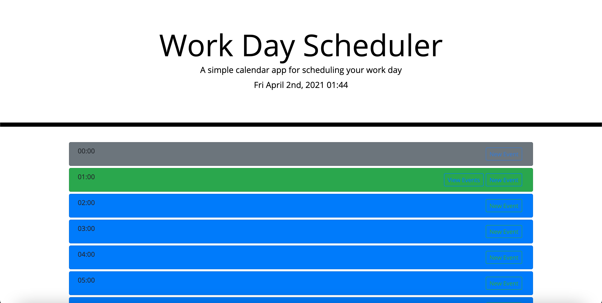

# Daily-Agenda
Plan your 7 days of the week.

-----MVP----- 
Presented at the start up screen, is the date/time and a list of each hour of the day 

The user will see color coded blocks for each hour of the day 
Grey = hour past 
Green = current hour 
Blue = future hours 

The current hour is the only space where a "View Events" button will appear 

Upon clickling on the new Event button the user will be presented a form asking for: 

1.) Start Time 
2.) End Time 
3.) Title of Event 
4.) Notes for Event 
 

If the user were to close the form, the contents will, reset. 
If the user were to save the form, then the event will be saved onto the local storage adn the form will close  
Upon clicking on the View Events button the user will be presented each Event that has been saved onto the localstroage 

GITHUB URL: https://github.com/Anthony2428/Daily-Agenda
Deplotment URL: https://anthony2428.github.io/Daily-Agenda/  

# 05 Third-Party APIs: Work Day Scheduler
